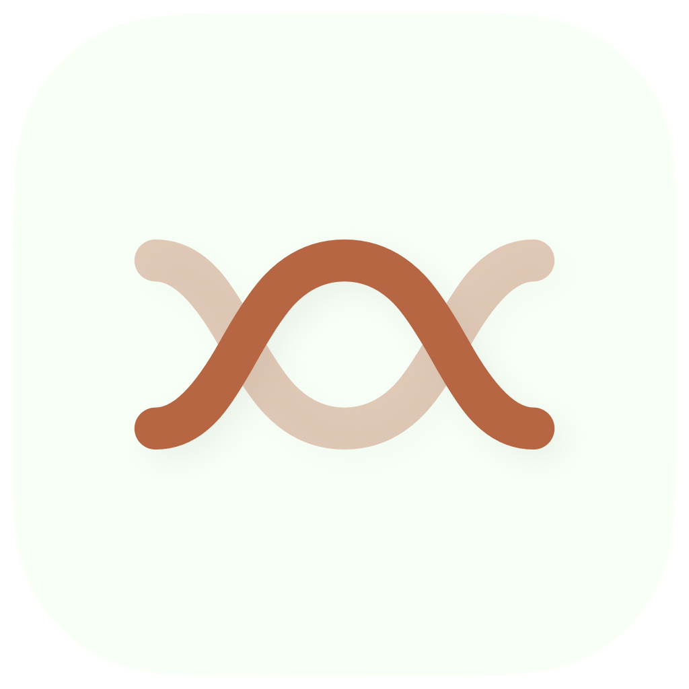

# Clome

**An AI-native development environment**



> **Status: Alpha** -- Clome is in early development. Expect breaking changes.

Clome is a native macOS development environment built with Swift and Metal, featuring a GPU-accelerated terminal powered by [libghostty](https://github.com/ghostty-org/ghostty). Designed from the ground up for the agentic coding era.

## Features

- **GPU-accelerated terminal** -- Full terminal emulation via libghostty with Metal rendering
- **Built-in code editor** -- CoreText-rendered editor with LSP support (completions, diagnostics, go-to-definition)
- **Multi-cursor editing** -- Add cursors with Cmd+Option+Click, select next occurrence with Cmd+D
- **Find and replace** -- Plain text and regex search with match highlighting
- **Syntax highlighting** -- 30+ languages with Tree-sitter integration ready
- **File explorer** -- Project tree view with real-time git status indicators
- **PDF viewer** -- Built-in PDFKit viewer with zoom, outline, and search
- **Jupyter notebooks** -- Full .ipynb support with kernel execution
- **LaTeX compilation** -- Compile .tex files to PDF with pdflatex, xelatex, or lualatex
- **Workspace management** -- Split panes, multiple workspaces, session persistence

## Requirements

- macOS 14.0+
- Xcode 16+ (with Metal Toolchain)
- Zig 0.15.2
- XcodeGen

## Build from Source

```bash
# Install dependencies
brew install zig xcodegen

# Clone the repository
git clone --recursive https://github.com/ranystephan/clome.git
cd clome

# Build libghostty (only needed once)
cd vendor/ghostty && zig build -Demit-xcframework -Doptimize=ReleaseFast && cd ../..

# Generate Xcode project and build
xcodegen generate
xcodebuild -project Clome.xcodeproj -scheme Clome -configuration Debug build
```

## Download

Download the latest release from the [Releases](https://github.com/ranystephan/clome/releases) page.

## Contributing

Clome is in early development. Issues and PRs are welcome. See [CONTRIBUTING.md](CONTRIBUTING.md) for guidelines.

## License

[MIT License](LICENSE)
